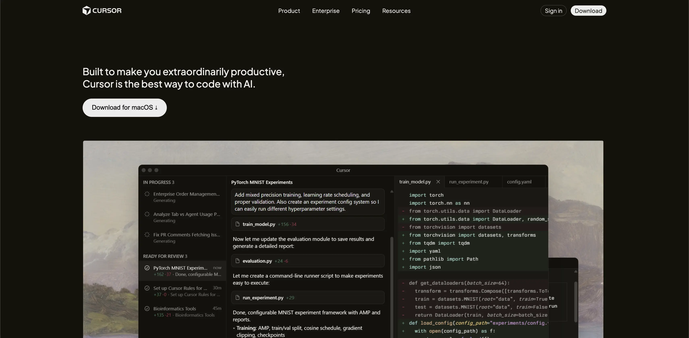
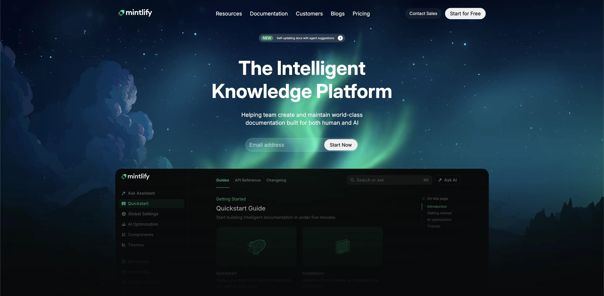

  
  <h1>ChaiCode Projects</h1>
  <h3><code>Coding Challenges & Experiments</code></h3>
  

    <b>A collection of assignments and experiments built with code & creativity.</b>
  

 

## 🚀 About This Collection

This directory contains various coding challenges, experiments, and assignments completed under the ChaiCode initiative. Each project serves as a standalone demonstration of specific skills and concepts.

---

## 🛠️ General Setup Instructions

To run these projects locally:

1.  **Environment**: Ensure you have a PHP environment set up (like XAMPP, MAMP, or a local LAMP stack).
2.  **Placement**: Clone or place the `veeshal` repository into your server's `htdocs` (or `www`) directory.
3.  **Access**: Start your Apache server and navigate to `http://localhost/veeshal/chaicode` in your browser.

---

## 📂 Projects

### 1. HTML Resume Page
**Description**: A semantic HTML-only resume page focusing on structure, accessibility, and clean markup without relying on external CSS frameworks.
- **Live Demo**: [HTML Resume Page](https://veeshal.me/chaicode/resume.html)

#### 📸 Screenshot

  

#### ⚙️ Setup Steps
This project is a static HTML file and requires no complex installation.
1.  Navigate to the `chaicode` directory.
2.  Ensure `resume.html` and the `assets` folder are present.
3.  Open the file directly in a browser or serve it via localhost:
    - **URL**: `http://localhost/veeshal/chaicode/resume.html`

#### 📖 Usage
- **Navigation**: Click on the social icon links to visit external profiles.
- **Evaluation**: Inspect the page source to review the use of proper semantic HTML5 tags (header, section, footer, etc.) and table structures.

---

### 2. Cursor Clone
**Description**: A semantic HTML-only cursor clone page focusing on structure, accessibility, and clean markup without relying on external CSS frameworks.
- **Live Demo**: [Cursor Clone](https://veeshal.me/chaicode/cursor)
- **GitHub**: [GitHub](https://github.com/veeshal/chaicode/cursor)

#### 📸 Screenshot

  

#### ⚙️ Setup Steps
This project is a static HTML file and requires no complex installation.
1.  Navigate to the `chaicode` directory.
2.  Ensure `cursor.html` and the `assets` folder are present.
3.  Open the file directly in a browser or serve it via localhost:
    - **URL**: `http://localhost/veeshal/chaicode/cursor.html`

#### 📖 Usage
- **Navigation**: Click on the social icon links to visit external profiles.
- **Evaluation**: Inspect the page source to review the use of proper semantic HTML5 tags (header, section, footer, etc.) and table structures.
---

### 3. Mintlify Clone
**Description**: A semantic HTML-only mintlify clone page focusing on structure, accessibility, and clean markup without relying on external CSS frameworks.
- **Live Demo**: [Mintlify Clone](https://veeshal.me/chaicode/mintlify)
- **GitHub**: [GitHub](https://github.com/veeshal/chaicode/mintlify)

#### 📸 Screenshot

  

#### ⚙️ Setup Steps
This project is a static HTML file and requires no complex installation.
1.  Navigate to the `chaicode` directory.
2.  Ensure `mintlify.html` and the `assets` folder are present.
3.  Open the file directly in a browser or serve it via localhost:
    - **URL**: `http://localhost/veeshal/chaicode/mintlify.html`

#### 📖 Usage
- **Navigation**: Click on the social icon links to visit external profiles.
- **Evaluation**: Inspect the page source to review the use of proper semantic HTML5 tags (header, section, footer, etc.) and table structures.

---

## 📬 Contact

- **Email**: veebodosa@gmail.com
- **Portfolio**: [veeshal.me](https://veeshal.me)